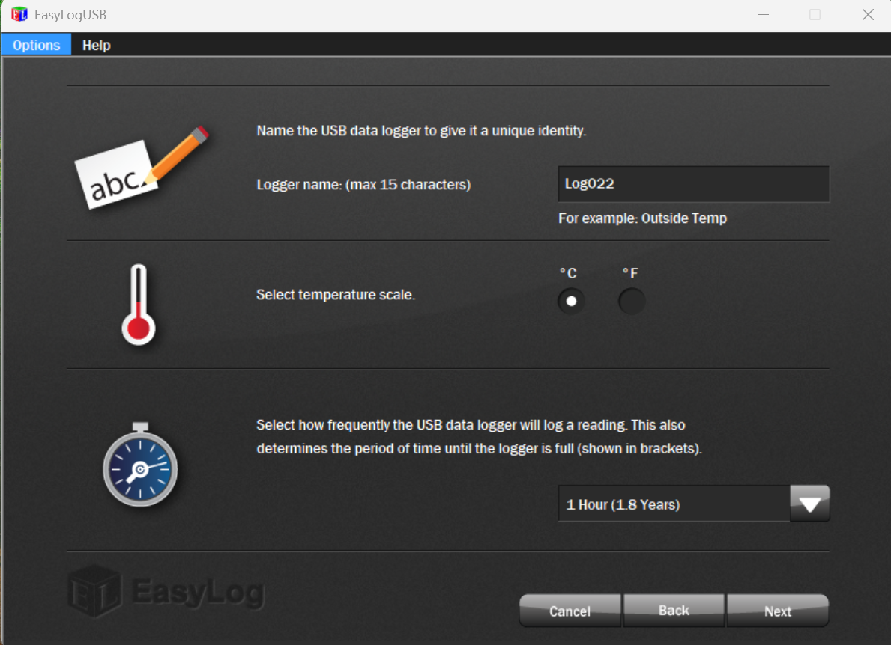

# Overview
Download the software EasyLog on the [website from Lascar Electronics](https://lascarelectronics.com/software/easylog-software/easylog-usb/) 
We recommend putting it on a rugged DELL laptop if your loggers are installed in challenging environment (rain, humidity, battery life).  

# Field protocol
**1. Check the logger**
* If one green LED is flashing, everything should be fine and the logger is still working. Proceed to step 2.
* If no LED is flashing, the battery might have died: install a new battery to see if the sensor reboots, then proceed to step 2.
* See below for other LEDs combinations and what they might mean.

  

**2. Download data**
 
1. *Open EasyLog.*
2. *Put logger in USB computer*
3. *Click: Stop the USB datalogger and Download data*

 
4. *The next screen will show you how many readings there are. Click: ok*

 
4. *Select where to save the data. We recommend adding _YYMMDD to the file name*

 
5. *If all went well, you will get a preview of the data*

 

**2. Change battery and restart logger**
 
1. *Open the logger. This is the easiest with a pen*
2. *Remove the old battery, and put a new one in (best done with 2 people where one only carries new batteries and the other one old batteries). The logger should reboot and go through a series of red and green LED flashes. If it doesn't boot up correctly, remove and reinsert the new battery*
3. *Put logger in the computer. Click: Set up and start the USB data logger*
 

4. *Change your logger name if needed. We typically log every hour:*
 

 

 

4. *If you are in the field, you can select immediate start. Make sure the laptop is in local time. Keep in mind that the time if fixed and will for example not change if day light saving time occurs in your place of install. This will need to be corrected later.*
 

 
5. *If all went well, you should get this message:*
 

**3. Additional checks**
 
1. *Is the radiation shield still fixed properly and oriented the right way (South for Southern hemisphere, North for Northern hemisphere)?*
2. *Check for potential water or humidity damage to the sensor and check if white filter at the end is still complete. Check if no animals live in the end part of the logger. If not ok, replace logger or part of the logger and do the setup again.*
 

 

 

 

 
3. *If the logger is a write-off, some parts can maybe be kept as spares*
